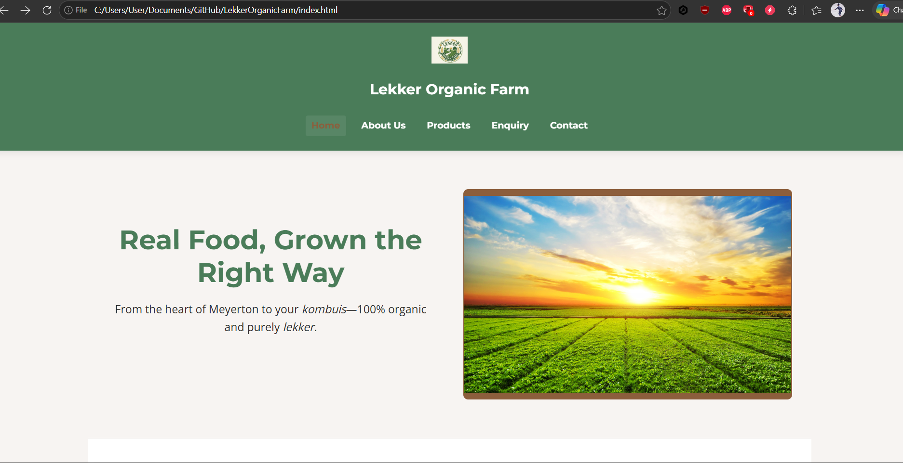

# LekkerOrganicFarm

# Lekker Organic Farm – Website Project (Part 1)

## Student Information
- **Name:** Dylan Tapiwanashe Musimwa  
- **Student Number:** ST10526381  
- **Module:** WEDE5020 – Web Development (Introduction)  

---

## Project Overview
This project involves designing and developing a functional, user‑centred website for **Lekker Organic Farm**, a small agricultural business based in Meyerton, Gauteng.  
Part 1 focuses on planning, research, content sourcing, and establishing the foundational HTML structure.

---

## Website Goals and Objectives
- Increase online visibility  
- Provide product information and pricing  
- Enable customer enquiries and bulk order requests  
- Support sustainable branding through digital presence  

---

## Sitemap
- **Home (index.html)** – Hero image, introduction, featured products, call to action  
- **About Us (about.html)** – History, mission, vision, farming practices  
- **Products (products.html)** – Product categories, pricing, bulk orders  
- **Enquiry (enquiry.html)** – Enquiry form for customers and bulk orders  
- **Contact (contact.html)** – Contact details, two maps, contact form  

---

## Folder Structure

---

Lekker Organic Farm Website
│
├── Home (index.html)
│     ├── Hero Section
│     ├── Introduction
│     ├── Featured Products
│     └── Call to Action
│
├── About Us (about.html)
│     ├── History
│     ├── Mission & Vision
│     └── Sustainable Farming Practices
│
├── Products (products.html)
│     ├── Vegetables
│     ├── Dairy
│     └── Bulk Order Information
│
├── Enquiry (enquiry.html)
│     ├── General Enquiry Form
│     ├── Bulk Order Request
│     └── Submission Instructions
│
└── Contact (contact.html)
      ├── Contact Details
      ├── Two Map Locations 
      └── Contact Form

---

## Timeline & Milestones
Key dates include:
- **14 April 2026:** Project initiation  
- **20 April 2026:** Part 1 submission  
- **May–June 2026:** CSS styling, responsive design, JavaScript functionality  
- **23 June 2026:** Final submission  

---

## Changelog

14 April 2026: Initial commit and project setup.

15 April 2026: Created project files for Part 1, establishing the final website skeleton, basic page layouts, and text formatting.

16 April 2026: Added project documentation, including the site map and content research files, alongside media assets (dairy.jpg).

21 May 2026: Fixed layout bugs and resolved initial repository link challenges.

22 May 2026: Created the global CSS template, integrated Google Fonts across all pages, and standardized header and navigation bar consistency.

23 May 2026: Added images and implemented advanced CSS layout structures to address initial alignment and mobile responsiveness challenges.

24 May 2026: Updated the header layout, refined the logo image integration in index.html, and cleaned up CSS comments for code clarity.

29 May 2026: Polished the readme.me file and fixed all refrences. Checked for responsiveness across multiple devices and attached evidence.

19 June 2026: Fixed buggs and altered the css style sheet for better aesthetics. 
            : Started with the javascripts aspect of the project
            : Inserted SEO and extra data
19 June 2026: Ensured the gallery box is added and added more content
            : Added the map for functional map view            
---

## Device Responsiveness

## Desktop view

## Mobile view

## Tablet view

## References
Color-Hex, 2025. #4a7c59 color-hex. Color-Hex, [online] Available at: https://www.color-hex.com/color/4a7c59 [Accessed 29 May 2026].

Color-Hex, 2025. #8c5e3c color-hex. Color-Hex, [online] Available at: https://www.color-hex.com/color/8c5e3c [Accessed 29 May 2026].

Color-Hex, 2025. #f7f4f2 color-hex. Color-Hex, [online] Available at: https://www.color-hex.com/color/f7f5f2 [Accessed 29 May 2026].

Color-Hex, 2025. Color-hex color palettes. Color-Hex, [online] Available at: https://www.color-hex.com/ [Accessed 29 May 2026].

Freepik, 2025. Free vectors, stock photos and psd. Freepik, [online] Available at: https://www.freepik.com/ [Accessed 29 May 2026].

Google Fonts, 2019. Montserrat font specimen. Google Fonts, [online font] Available at: https://fonts.google.com/specimen/Montserrat [Accessed 29 May 2026].

Google Fonts, 2019. Open Sans font specimen. Google Fonts, [online font] Available at: https://fonts.google.com/specimen/Open+Sans [Accessed 29 May 2026].

Google Fonts, n.d. Search fonts portal. Google Fonts, [online font] Available at: https://fonts.google.com/ [Accessed 29 May 2026].

Unsplash, 2019. Unsplash photography library. Unsplash, [image online] Available at: https://unsplash.com/images [Accessed 29 May 2026].

Le, T., [s.a.]. Vegetable stand photo. [electronic print] Available at: https://unsplash.com/photos/vegetable-stand-photo-pRJhn4MbsMM [Accessed 22 June 2026].  

Birai, V., 2022. A large pile of green leaves. [electronic print] Available at: https://unsplash.com/photos/a-large-pile-of-green-leaves-pdHbw-kEH_I [Accessed 22 June 2026].  

Tomato mix, 2023. [electronic print] Available at: https://images.unsplash.com/photo-1692736997565-547c794c10e9?w=600&auto=format&fit=crop&q=60&ixlib=rb-4.1.0&ixid=M3wxMjA3fDB8MHxzZWFyY2h8NHx8dG9tYXRvJTIwbWl4fGVufDB8fDB8fHww [Accessed 22 June 2026].  

Fath, R., [s.a.]. A pile of different types of vegetables on a white surface. [electronic print] Available at: https://unsplash.com/photos/a-pile-of-different-types-of-vegetables-on-a-white-surface-5aJVJvJ9rG8 [Accessed 22 June 2026].  

Gios, J., 2022. A close-up of some cheese. [electronic print] Available at: https://unsplash.com/photos/a-close-up-of-some-cheese-hEyrpAhp9kc [Accessed 22 June 2026].  

A bowl of food that is on a table, [s.a.]. [electronic print] Available at: https://unsplash.com/photos/a-bowl-of-food-that-is-on-a-table-dmusxNBR2hk [Accessed 22 June 2026].  

A bottle of milk, a bottle of milk, and a bottle of milk on a table, [s.a.]. [electronic print] Available at: https://unsplash.com/photos/a-bottle-of-milk-a-bottle-of-milk-and-a-bottle-of-milk-on-a-vEyp-NegA9k [Accessed 22 June 2026].  

pinach bundle, 2022. [electronic print] Available at: https://images.unsplash.com/photo-1668717066198-53148ca2b11b?w=1000&auto=format&fit=crop&q=60&ixlib=rb-4.1.0&ixid=M3wxMjA3fDB8MHxzZWFyY2h8MjB8fFNwaW5hY2glMjBidW5kbGV8ZW58MHx8MHx8fDA%3D [Accessed 22 June 2026].  
 
---
